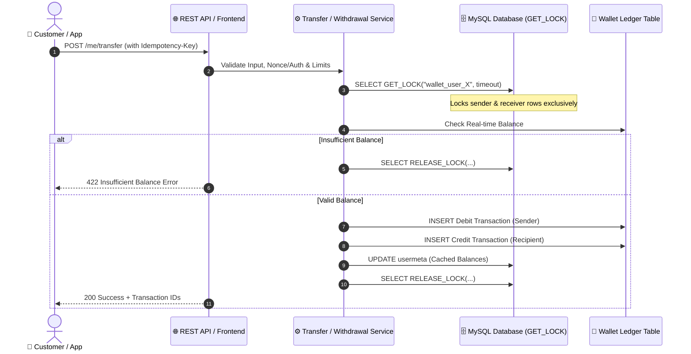

<p align="center">
  <br>
  
  <h1 align="center">💳 Axfit Wallet for WooCommerce</h1>
  <p align="center">
    <strong>A high-performance, concurrency-safe digital wallet, store credit, and rewards engine for WooCommerce & headless mobile applications.</strong>
  </p>
  <p align="center">
    <a href="https://github.com/Hossamster/woo-wallet/releases/latest"></a>
    <a href="https://php.net"></a>
    <a href="https://woocommerce.com"></a>
    <a href="https://wordpress.org"></a>
    
    <a href="https://github.com/Hossamster/woo-wallet/actions"></a>
    <a href="LICENSE"></a>
  </p>
</p>

---

## 📖 Overview

**Axfit Wallet** is an enterprise-grade digital wallet, store credit, and loyalty engine built for high-volume WooCommerce stores, hybrid stores, and headless/mobile applications (Flutter, React Native, iOS, Android).

Unlike standard wallet plugins that suffer from race conditions under concurrent requests or lack headless capabilities, Axfit Wallet was engineered from the ground up for **strict money-safety**, **SQL-level atomic locking**, **API-first architecture**, and **frictionless customer experience**.

> [!IMPORTANT]
> **Fintech-Grade Money Safety**: Every transaction executes inside transactional locks (`GET_LOCK()`) paired with idempotency verification. Double-spending, balance race conditions, and replay attacks are mathematically prevented.

---

## ⚡ Highlights & Key Features

<table>
  <tr>
    <td width="50%">
      <h3>🏦 Bulletproof Ledger System</h3>
      <ul>
        <li>Centralized, double-entry bookkeeping ledger.</li>
        <li>MySQL <code>GET_LOCK()</code> concurrency locking.</li>
        <li>Zero balance drift, double-debits, or race conditions.</li>
        <li>Cryptographic idempotency keys for API & forms.</li>
      </ul>
    </td>
    <td width="50%">
      <h3>💳 Smart Checkout & Partial Payments</h3>
      <ul>
        <li>1-Click instant checkout with wallet funds.</li>
        <li>Split payments: Wallet + Stripe, PayPal, Instapay, or Cash.</li>
        <li>Configurable auto-deduct discount at checkout.</li>
        <li>Full WooCommerce Blocks & Classic Checkout support.</li>
      </ul>
    </td>
  </tr>
  <tr>
    <td width="50%">
      <h3>🏧 Bank Payouts & Withdrawals</h3>
      <ul>
        <li>Self-service customer bank payout requests.</li>
        <li>Admin manual requests (phone / offline logging).</li>
        <li>Validates Bank, Beneficiary, Account, IBAN & Phone.</li>
        <li>Receipt uploads with 90-day auto-purge retention.</li>
        <li>Idempotent recovery on interrupted refunds.</li>
      </ul>
    </td>
    <td width="50%">
      <h3>🔄 Peer-to-Peer Transfers</h3>
      <ul>
        <li>Instant fund transfers between customers.</li>
        <li>Configurable fixed or percentage transfer fees.</li>
        <li>Built-in soft rate limiting (prevents spam/abuse).</li>
        <li>Custom transfer notes & transactional emails.</li>
      </ul>
    </td>
  </tr>
  <tr>
    <td width="50%">
      <h3>🎁 Dynamic Cashback Engine</h3>
      <ul>
        <li>Cart-level, product-level, and category-level rules.</li>
        <li>Percentage or fixed reward configurations.</li>
        <li>Automated clawback on order cancellation/refund.</li>
        <li>Signup bonuses, daily logins, and review incentives.</li>
      </ul>
    </td>
    <td width="50%">
      <h3>📱 Mobile & Headless REST API</h3>
      <ul>
        <li>Production-grade <code>terawallet/v1</code> REST API.</li>
        <li>Dedicated <code>/me</code> routes for user accounts.</li>
        <li>Comprehensive <code>/admin</code> control endpoints.</li>
        <li>Complete markdown documentation in <code>/docs</code>.</li>
      </ul>
    </td>
  </tr>
</table>

---

## 🏗️ Architecture & Money-Safety Flow

The diagram below illustrates how a money-moving operation (such as a wallet-to-wallet transfer or withdrawal) is processed safely:



---

## 🛠️ Admin Control Center

Axfit Wallet gives store administrators complete oversight and management capabilities:

```
Axfit Wallet
├── 📊 Dashboard        -> High-level metrics, balance totals, and activity
├── 📜 Transactions     -> Store-wide searchable audit ledger across all users
├── 🏧 Withdrawals      -> Multi-status payout requests queue (Pending, Processing, Paid, Rejected)
└── ⚙️ Settings         -> General, Cashback, Transfer, Withdrawal, & Gateways configuration
```

### Advanced Withdrawals Management
* **Status Views:** WordPress-native filter tabs with live counters: `All`, `Pending`, `Processing`, `Paid`, and `Rejected`.
* **Universal Search:** Instantly search across customer name, email, contact phone number, beneficiary name, account number, IBAN, and reference code.
* **Granular Filters:** Filter by receipt presence (*With receipt* vs *Missing receipt*), processor staff member, min/max amount range, and date range.
* **Excel & Arabic-Optimized CSV Export:** Exports with UTF-8 BOM encoding so Arabic text displays flawlessly in Microsoft Excel, and prepends single quotes to account numbers and phone numbers to prevent truncation of leading zeros or scientific notation.

---

## 🔌 REST API Reference

The plugin exposes a clean, standardized, and self-contained REST API under the **`terawallet/v1`** namespace. Full specifications, request bodies, and code samples can be found in the [`docs/`](docs/) directory.

| Endpoint | Method | Role | Description | Documentation |
|:---|:---:|:---:|:---|:---:|
| `/me` | `GET` | Customer | Get customer wallet balance & profile | [API-ME.md](docs/API-ME.md) |
| `/me/transactions` | `GET` | Customer | Paginated transaction ledger history | [API-ME.md](docs/API-ME.md) |
| `/me/topup` | `POST` | Customer | Initiate wallet balance deposit/order | [API-ME.md](docs/API-ME.md) |
| `/me/transfer` | `POST` | Customer | P2P fund transfer to another user | [API-ME.md](docs/API-ME.md) |
| `/me/withdrawals` | `GET`, `POST` | Customer | List or submit bank withdrawal requests | [API-WITHDRAWALS.md](docs/API-WITHDRAWALS.md) |
| `/admin/transactions` | `GET`, `POST` | Staff | Global audit ledger; manual credit/debit | [API-ADMIN.md](docs/API-ADMIN.md) |
| `/admin/withdrawals` | `GET`, `POST` | Staff | Admin withdrawal queue & manual logging | [API-WITHDRAWALS.md](docs/API-WITHDRAWALS.md) |
| `/admin/withdrawals/{id}/process` | `POST` | Staff | Mark withdrawal as Paid or Rejected | [API-WITHDRAWALS.md](docs/API-WITHDRAWALS.md) |
| `/settings/public` | `GET` | Public | Publicly visible wallet rules & limits | [API-SETTINGS.md](docs/API-SETTINGS.md) |

> [!TIP]
> All money-moving POST routes require or honor the standard `Idempotency-Key` HTTP header to protect against network retries or client-side double submits.

---

## 🌍 Multi-Currency Compatibility

Axfit Wallet provides first-class support for multi-currency WooCommerce ecosystems. All top-ups, transfers, balances, and payouts dynamically convert using the active rates of your preferred currency switcher:

* 🟢 **YayCurrency** – Multi-Currency Switcher
* 🟢 **WOOCS** – WooCommerce Currency Switcher (FOX)
* 🟢 **WPML Multi-Currency** (WCML)
* 🟢 **CURCY** – Multi Currency for WooCommerce (VillaTheme)
* 🟢 **Aelia Currency Switcher**
* 🟢 **Generic Engine Fallback** via `woocommerce_currency` hooks with comprehensive audit logging.

---

## 🧪 Automated Testing & CI/CD

Quality assurance is enforced through a strict automated testing harness built on **PHPUnit** and **GitHub Actions**:

```bash
# Run the entire test suite locally
composer test

# Run a specific domain test suite
./vendor/bin/phpunit tests/phpunit/withdrawal/
./vendor/bin/phpunit tests/phpunit/transfer/
./vendor/bin/phpunit tests/phpunit/cashback/
./vendor/bin/phpunit tests/phpunit/rest/
```

### Coverage Overview:
* **Transfers**: Validates atomic locking, balances, service layers, and REST routes.
* **Cashback**: Tests computation engine, double-credit protection, and cancellation clawback.
* **Withdrawals**: Verifies request validation, receipt lifecycle, idempotent recovery, and admin list filtering.
* **Security**: Tests CSRF nonce verification, privilege separation, and capability checks on AJAX and REST interfaces.

---

## 🚀 Installation & Requirements

### System Requirements
* **PHP:** `7.4` or higher (PHP `8.1` / `8.2` recommended)
* **WordPress:** `6.4` or higher
* **WooCommerce:** `7.2` or higher (HPOS fully supported)
* **MySQL:** `5.7+` or **MariaDB:** `10.2+` (Required for database-level locking primitives)

### Installation
1. Download the latest release `.zip` from [GitHub Releases](https://github.com/Hossamster/woo-wallet/releases).
2. Go to **WordPress Admin > Plugins > Add New > Upload Plugin**.
3. Select the `.zip` file and click **Install Now**.
4. Click **Activate Plugin**.
5. Configure your settings under **Axfit Wallet > Settings**.

---

## 🔄 Self-Hosted Updates via GitHub

Axfit Wallet includes a self-hosted update mechanism powered by **GitHub Releases**. 

* Whenever a new stable release is published on GitHub, administrators will see the standard WordPress **"Update Available"** notice directly inside `wp-admin/plugins.php`.
* Updates can be applied with a single click, completely independent of the WordPress.org repository.
* Detailed instructions on building and publishing releases can be found in [`docs/RELEASING.md`](docs/RELEASING.md).

---

## 🪝 Popular Developer Hooks & Filters

Extend or customize wallet behavior with native WordPress filters:

```php
// Customize soft rate limit for P2P transfers (default: 5 transfers / minute)
add_filter( 'woo_wallet_transfer_rate_limit_per_minute', function( $limit, $user_id ) {
    return 10;
}, 10, 2 );

// Modify withdrawal receipt retention days before automatic cleanup (default: 90 days)
add_filter( 'woo_wallet_withdrawal_receipt_retention_days', function( $days ) {
    return 180; // Keep receipts for 6 months
} );

// Customize transfer transaction notes
add_filter( 'woo_wallet_transfer_credit_transaction_note', function( $note, $recipient, $amount ) {
    return sprintf( 'Received %s via Axfit Wallet Transfer', wc_price( $amount ) );
}, 10, 3 );
```

---

## 📄 License & Attribution

Axfit Wallet is open-source software licensed under the **[GNU General Public License v3.0 (GPLv3)](LICENSE)**.

Developed and maintained with ❤️ for fast, secure, and scalable commerce.
